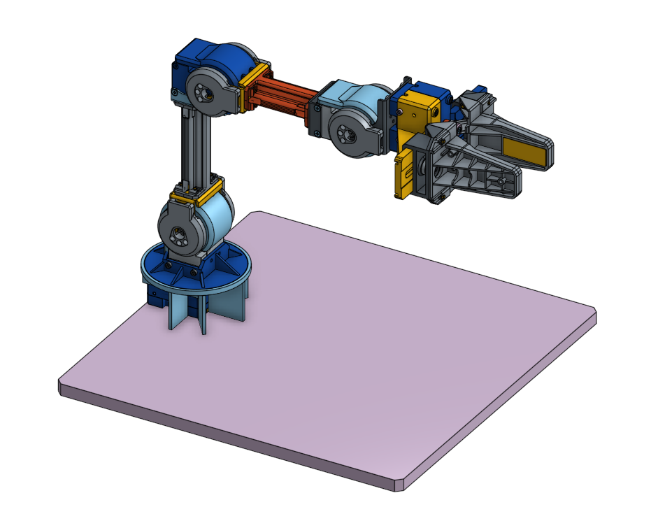
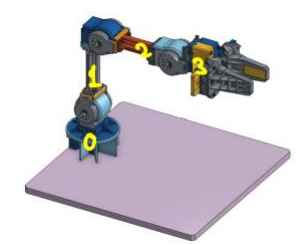
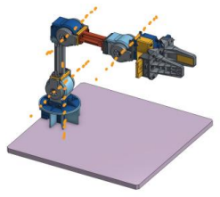
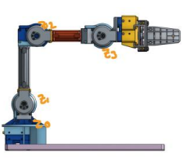
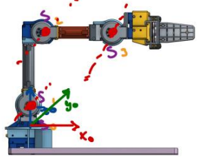
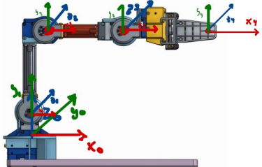
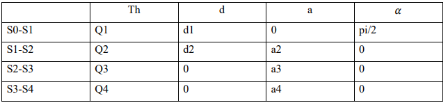

  

# Pick and Place

This project is a pick and place solution for the OpenManipulatorX.

## Requirements

To run this project you need the following components:

- Ubuntu 20.04.
- ROS Noetic.
- Matlab.
- OpenManipulatorX.
- Open CR.
- Gazebo (Optional)

## Installation

1. Clone the repository on your computer:
git clone https://github.com/your_username/pick-and-place.git

markdown
Copy code

2. Install the project dependencies:
pip install -r requirements.txt

markdown
Copy code

## Usage

1. Connect all the project components and make sure they are working properly.
2. Start the robot control software and load the motion control program `pick_and_place.py`.
3. Start the vision control software and load the piece detection program `piece_detection.py`.
4. Execute the motion control program to position the robot in the appropriate location.
5. Execute the piece detection program to have the vision sensor detect the parts to be assembled.
6. Execute the motion control program to have the robot pick up and assemble the parts.
7. Repeat the process until all the parts have been assembled.

## Contribution

If you want to contribute to this project, please follow these steps:

1. Fork this repository.
2. Create a new branch for your contribution.
3. Make your changes and commit with a descriptive message.
4. Push your changes to your repository.
5. Create a pull request to this repository and describe your changes.

## License

This project is licensed under the MIT License. See the LICENSE.md file for more details.
I hope this helps! Good luck with your project.

# Development

## Procedure to calculate the Denavit-Hartenberg parameters

In order to obtain the kinematic analysis of the Robot, it is required to obtain the Denavit-Hartenberg parameters, this by means of the fifteen steps.
In order to obtain the kinematic analysis of the robot, it is required to obtain the Denavit-Hartenberg parameters, this by means of the fifteen steps, nevertheless, the most important thing is to consider which is the position 0 of the robot, in the following image we can see how the OPENMANIPULATOR X is the position 0.

  

As this is the expected configuration, we started to elaborate each of the steps to obtain the parameters.
parameters.

1. Number the links: "0" will be called the "ground", or fixed base where the robot is anchored. "1" the first
first mobile link, etc. 0-1-2-3 Links.

  

2.Number the joints: "1" will be the first degree of freedom, and "n" the last. 1-4 Articulations

3. Locate the axis of each joint: For pairs of revolution, it will be the axis of rotation. For prismatic, it will be the axis along which the link moves.

  

4. Z axes: We start placing the XYZ systems. We place the Zi-1 on the axes of the i joints, with i = 1, . . . ., n. That is, Z0 goes on the axis of the 1st joint, Z1 goes on the axis of the 2nd degree of freedom, etc.

  

5. Coordinate system 0: The origin point is located at any point along Z0. The orientation of X0 and Y0 can be arbitrary, provided of course that XYZ is a dextrorotating system.
6. Rest of systems: For the rest of the systems i = 1, . . . ., N - 1, place the origin point at the intersection of Zi with the normal common to Zi and Zi+1. intersection of Zi with the normal common to Zi and Zi+1. In case the two Z axes intersect, place it at that point of intersection. In case they are parallel, place it in some point of the i + 1 joint.

  

7. X-axis Each Xi goes in the direction of the normal common to Zi-1 and Zi, in the direction from Zi-1 to Zi. to Zi.
8. Y axes: Once the Z and X axes are located, the Y axes have their directions determined by the constraint of forming a dextrorotating XYZ. constraint of forming a dextrorotating XYZ.
9. Robot end system: The n-th XYZ system is placed at the robot end (tool), with its Z axis (tool), with its Z-axis parallel to Zn-1 and X and Y in any valid direction.

  

10. Angles θ: Each θi is the angle from Xi-1 to Xi revolving around Zi.

Θ1=-180° & 180°
Θ2=-180° & 180°
Θ3=-180° & 180°
Θ4=-180° & 180°

11. Distances d: Each di is the distance from the XY system Zi-1 to the intersection of the common normals of Zi-1 towards Zi , along Zi-1 . common normals from Zi-1 to Zi , along Zi-1.

d1 = 0.77 mm
d2 =0.128 mm
d3 =0mm
d4 =0mm

12. Distances a: Each ai is the length of such common normal.

a1=0mm
a2=0.024mm
a3=0.124mm
a4=0.126mm

13. Angles ' α: Angle to rotate ' Zi-1 to reach Zi, rotating around Xi.

𝛼1=pi/2
𝛼2=0
𝛼3=0
𝛼4=0

14. Total transformation: The total transformation matrix relating the robot base to its tool is the chaining (multiplication) of all these matrices: T =0 A1 ∗ 1 A2 ∗ .... n-1An

  

## Obtaining and validation of the Forward Kinematics and Inverse Kinematics using Matlab.

Made the DH parameters, it is possible to obtain the direct and inverse kinematics of the robot, this will be done using the Matlab software, in conjunction with Peter Corke's "Robotics Toolbox" plugin, by obtaining and validating both kinematics we can obtain the kinematic analysis of the robot.

In general, the procedure consists of generating the robot in Matlab, giving the specifications of the measurements and types of the joints, as well as the rotation that they have, that is, substituting the values in the DH matrix, which remains in the following way:

(IMAGEN DE DH CON VALORES)

Using the ".teach" command, the graphical interface of the robot is printed, which is as follows:

(IMAGEN DL ROBOT EN MATLAB)

The direct kinematics is obtained by calculating through the analysis of each of the joints, to later obtain the analysis of the entire robot by multiplying the results of all the joints, the procedure for each joint is as follows:

(IMAGE OF THE GENERAL PROC OF THE CD)

Therefore, it is enough to substitute the values ​​in each of the operations, said values ​​are the same as those of the DH table, this applies to all the joints of our robot, with which it only remains to multiply the analyzes of the different joints. To know that the calculation is correct, the values of the matrix obtained are compared with the values ​​of the simulation, as observed below:

(Image of the robot and the CD)

Since the values are the same, the calculation is correct.

To obtain the inverse kinematics, a complex analysis must be carried out for each joint, in which the procedure differs depending on the characteristics of each one, so using the Robotics Toolbox plugin, the ".ikine" command can be used, which performs the calculation in the position that we assign, the result is shown below:

(IMAGEN DE LA CI CON EL ROBOT)

With both kinematics validated, we proceed to use Ross and Gazebo.
