<a name="top"></a>
# Pick and Place
<p align="center">
  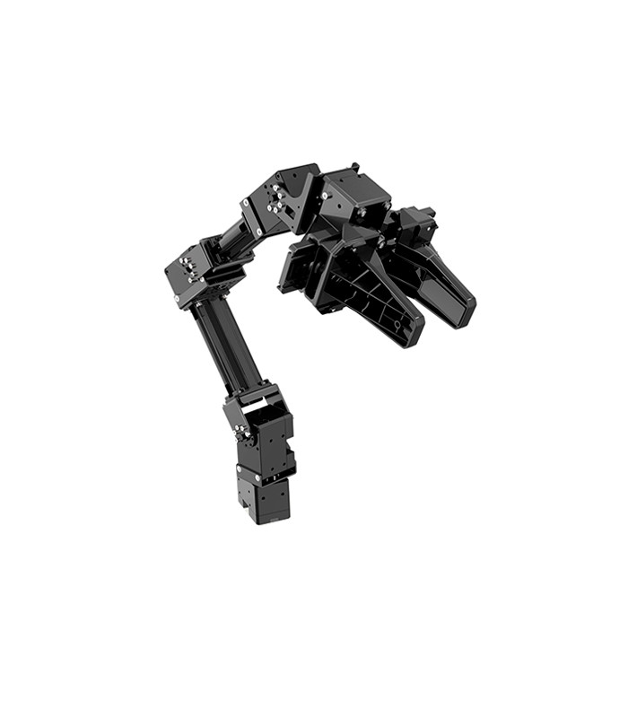 
</p>


<p align="center">This is an implementation of a pick and place solution for the OpenManipulatorX.

## Project Overview
The Open MANIPULATOR-X robot based on ROS is one of the most commonly used robotic arms for training in the industry. In this project, a Pick and Place operation that will be performed using this robot arm. The goal is to create a program that instructs the robotic arm to pick up a series of objects and place them at a specific point in the workspace. Prior to this, a thorough analysis of the arm will be conducted to obtain its direct and inverse kinematics, and will be done using Matlab software in collaboration with the Robotics Toolbox plug-in developed by Peter Corke. For the Open MANIPULATOR-X will be used the teleoperation funtions to create a new project that execute the Pick and Place.
  
  
  
## Content List
- [Pick and Place](#pick-and-place)  
- [Project Overview](#project-overview)  
- [Requirements](#requirements)
- [Robot kinematics](#robot-kinematics)
  - [Denavit-Hartenberg parameters](#denavit-hartenberg-parameters)
  - [Obtaining and Validation of the Forward Kinematics and Inverse Kinematics using Matlab](#obtaining-and-validation-of-the-forward-kinematics-and-inverse-kinematics-using-matlab)
- [Initial Setup](#initial-setup)
  - [Installation](#installation)
  - [Open CR](#open-cr)
  - [Simulation](#simulation)
  - [Changes in the original project](#changes-in-the-original-project)
- [Add New Things](#add-new-things)
- [Important Links](#important-links)
- [Contact](#contact)
## Requirements

To run this project you need the following components:

- Ubuntu 20.04.
- ROS Noetic.
- Matlab.
- OpenManipulatorX.
- Open CR.
- Gazebo (Optional)

# Robot kinematics

### Denavit-Hartenberg parameters.

The Denavit-Hartenberg (DH) parameters are a systematic procedure that is used to describe the kinematic structure of an articulated chain made up of joints with a single degree of freedom. Through this procedure, the DH matrix is obtained, the which includes data such as the distance to move in the z axis (d1), the distance to move in the x axis (a1), the rotation to perform in the z axis (theta1) and the rotation in the x axis (alpha1).

It is important to mention that for the construction and simulation of this robot, the first two articulations are generated first, then it must be observed that q2 has an offset, because it must be taken into account that the distance from the hypotenuse is measured. From the links of articulations 2 and 3, created the offset, it is possible to continue with the third articulation, likewise, from this third articulation the offset of articulation 2 must be subtracted, this because ee is the only offset, with this it is possible to create the fourth update.
  
  <p align="center">
  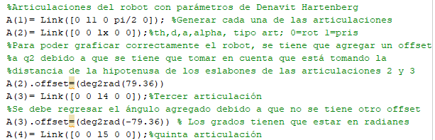
  </p>
  
### Obtaining and validation of the Forward Kinematics and Inverse Kinematics using Matlab.

Made the DH parameters, it is possible to obtain the direct and inverse kinematics of the robot, this will be done using the Matlab software, in conjunction with Peter Corke's "Robotics Toolbox" plugin, by obtaining and validating both kinematics we can obtain the kinematic analysis of the robot.

In general, the procedure consists of generating the robot in Matlab, giving the specifications of the measurements and types of the joints, as well as the rotation that they have, that is, substituting the values in the DH matrix, which remains in the following way:

<p align="center">
  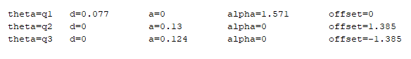
</p>

Using the ".teach" command, the graphical interface of the robot is printed, which is as follows:


<p align="center">
  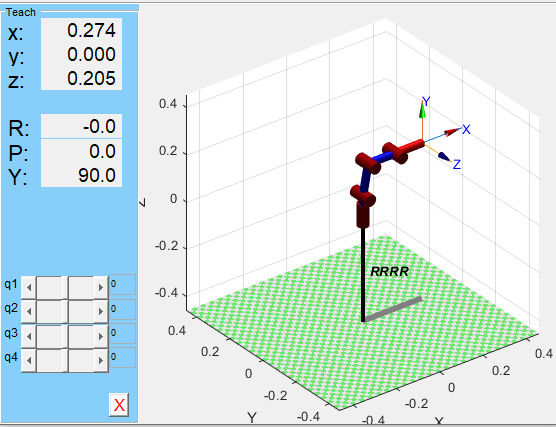
</p>


The direct kinematics is obtained by calculating through the analysis of each of the joints, to later obtain the analysis of the entire robot by multiplying the results of all the joints, the procedure for each joint is as follows:

<p align="center">
  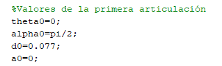
</p>

Therefore, it is enough to substitute the values ​​in each of the operations, said values ​​are the same as those of the DH table, this applies to all the joints of our robot, with which it only remains to multiply the analyzes of the different joints. To know that the calculation is correct, the values of the matrix obtained are compared with the values ​​of the simulation, as observed below:

<p align="center">
  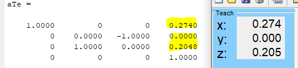
</p>


Since the values are the same, the calculation is correct.

To obtain the inverse kinematics, a complex analysis must be carried out for each joint, in which the procedure differs depending on the characteristics of each one, so using the Robotics Toolbox plugin, the ".ikine" command can be used, which performs the calculation in the position that we assign, the result is shown below:

<p align="center">
  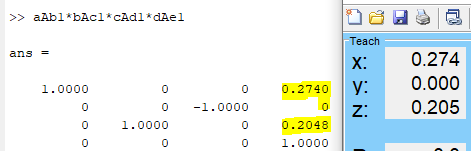
</p>


With both kinematics validated, we proceed to use Ros and Gazebo.


[Back to Top](#top)
## Initial Setup

### Installation
Is important to say that is recomended to install Ubuntu 20.04 in the computer not in a Virtual Box.
The OpenManipulator is configurated to work in ROS Noetic in the mentioned Ubuntu version, once the Ubuntu is installed is recomender to install ROS from the Wiki:
http://wiki.ros.org/noetic/Installation/Ubuntu


However the installation also can be donde with this comand that is the fast installation:
```ROS
$ sudo apt update
$ wget https://raw.githubusercontent.com/ROBOTIS-GIT/robotis_tools/master/install_ros_noetic.sh
$ chmod 755 ./install_ros_noetic.sh
$ bash ./install_ros_noetic.sh
```

Install dependent pacakges
```ROS
$ source ~/.bashrc
$ sudo apt-get install ros-noetic-ros-controllers ros-noetic-gazebo* ros-noetic-moveit* ros-noetic-industrial-core
$ sudo apt install ros-noetic-dynamixel-sdk ros-noetic-dynamixel-workbench*
$ sudo apt install ros-noetic-robotis-manipulator
```
Download and build OpenMANIPULATOR-X packages
```ROS
$ cd ~/catkin_ws/src/
$ git clone -b noetic-devel https://github.com/ROBOTIS-GIT/open_manipulator.git
$ git clone -b noetic-devel https://github.com/ROBOTIS-GIT/open_manipulator_msgs.git
$ git clone -b noetic-devel https://github.com/ROBOTIS-GIT/open_manipulator_simulations.git
$ git clone https://github.com/ROBOTIS-GIT/open_manipulator_dependencies.git
$ cd ~/catkin_ws && catkin_make
```
This project is an addition for the OpenManipulator_teleop, a cpp programan was created in the src and all the dependencies as the lunch and the header where created, also the Cmake file was modified to add the pick and place funtion, so to get this project once all the OpenMANIPULATOR-X packages are installed, a new code can be created with the name and location of the files that are added in this repository, it can be added by VS code or directly in the text editor but save it with the corresponding name
### Open CR
Once all the OpenMANIPULATOR-X packages are installed and ROS the hardware provided by the lab for the manipulation of the Robot is the Open CR 
<p align="center">
  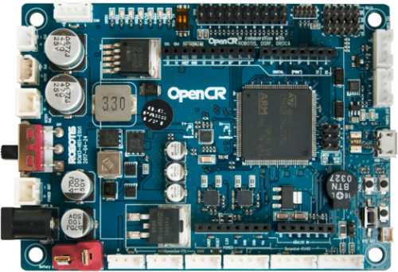 
</p>
In order to connect the computer to the Open Manipulator X is important to download Arduino, the version downloaded by the date of this project is the Arduino IDE 1.8.19 and the version is for Linux.


https://www.arduino.cc/en/software


Once Arduino is downloaded is time to configure the Open CR to the port of the computer, the Open has a guide where in case of the Open CR is not flashed the new user can configured as well

https://emanual.robotis.com/docs/en/parts/controller/opencr10/#arduino-ide

First the ports are configured:

USB Port Settings
```ROS
$ wget https://raw.githubusercontent.com/ROBOTIS-GIT/OpenCR/master/99-opencr-cdc.rules
$ sudo cp ./99-opencr-cdc.rules /etc/udev/rules.d/
$ sudo udevadm control --reload-rules
$ sudo udevadm trigger
```
Compiler Settings
```ROS
$ sudo apt-get install libncurses5-dev:i386
```
Now once Arduino is downloaded extract the file and install it.

```ROS
$ cd ~/downloads/arduino-1.8.19
$ ./install.sh
```
Set the file path of installed Arduino IDE as an absolute path named PATH in the bashrc file.
```ROS
$ gedit ~/.bashrc
$ export PATH=$PATH:$HOME/tools/arduino-1.8.19
$ source ~/.bashrc
```
Porting to Arduino IDE(Linux)
Install the OpenCR package via Boards Manager
Click Tools → Board → Boards Manager.
<p align="center">
  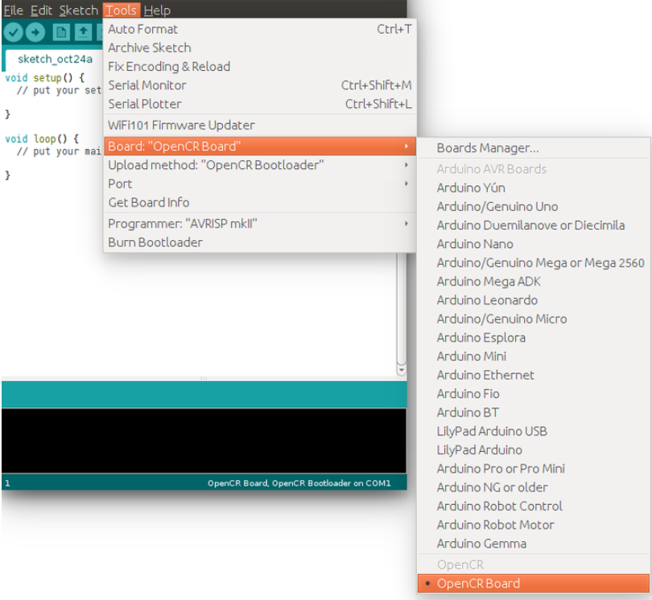 
</p>
<p align="center">
  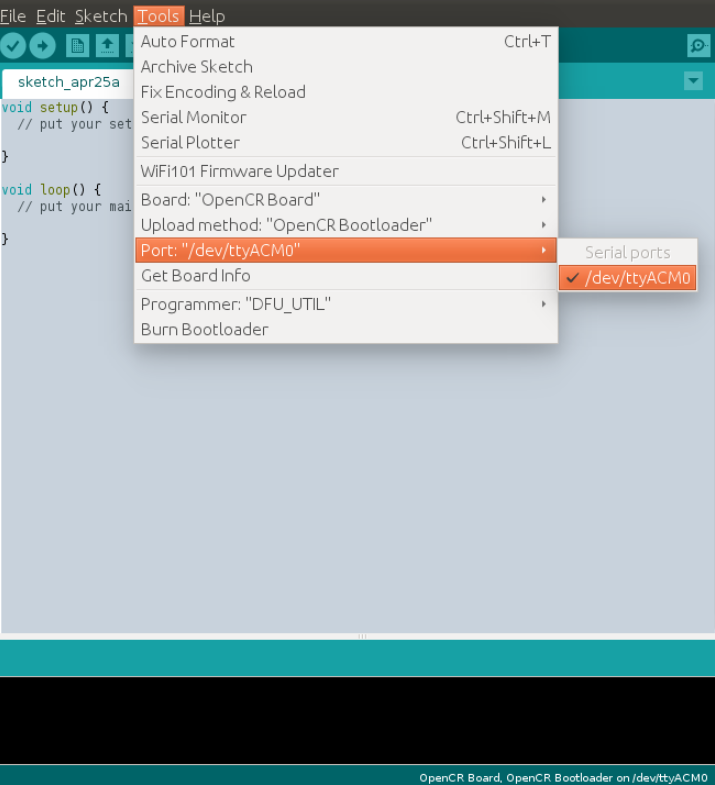 
</p>
However, if is not clear enough there is the link for the Open CR in the links given above

[Back to Top](#top)
### Simulation
Once all the previous steps are done the implementation can be done.

For initialized the Open is command is necessary to give torque to the motors by the following comand:
```ROS
$ roslaunch open_manipulator_controller open_manipulator_controller.launch usb_port:=/dev/ttyACM0 baud_rate:=1000000
```
To run the project you need to write the following command
```ROS
$ roslaunch open_manipulator_teleop open_manipulator_teleop_Pick_and_Place.launch
```
<p align="center">
  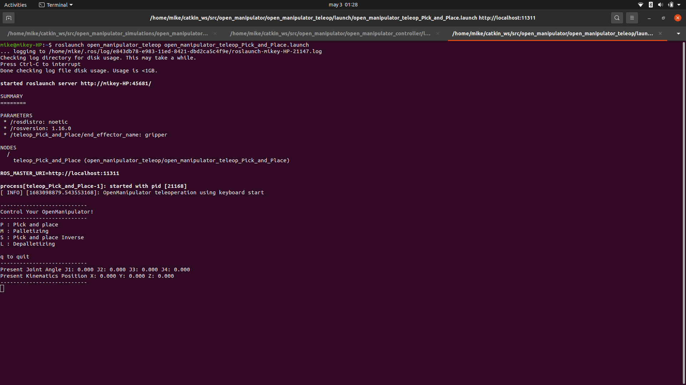 
</p>
Once the user select a option, the interface will be showing each step that the robot needs to complete the task selected.

Finally, depending of the choice the robot wil start moving, in the video is shown the Palletizing and the Depalletizing:


<p align="center">
  <a href="https://www.youtube.com/watch?v=AY5m8ooS1Zg"></a>
</p>

## Changes in the original project
All the codes were created in c++ taking as a base the Original file of OpenManipulator_Teleop, if you want to use this example of pick and place you can add all the files to the original documents in the part of OpenManipulator_Teleop, as the Header, the Lunch and the C++ in the src file where is located the program, also is important to modify the CMakeLists.txt, the exact part that needs to be added is the following part:

```ROS
add_executable(open_manipulator_teleop_Pick_and_Place src/open_manipulator_teleop_Pick_and_Place.cpp)
add_dependencies(open_manipulator_teleop_Pick_and_Place ${${PROJECT_NAME}_EXPORTED_TARGETS} ${catkin_EXPORTED_TARGETS})
target_link_libraries(open_manipulator_teleop_Pick_and_Place ${catkin_LIBRARIES})
```
Where this code is responsible for compiling and building an executable named "open_manipulator_teleop_Pick_and_Place", specifying its dependencies, and linking necessary libraries to it in a ROS project.

You can add this files in VS code or in a text note just save the files with the same name and termination, and for the Cmake just modify it.


## Add New Things

If you want to contribute to this project, please follow these steps:

1. set the positions of the things that are going to be pick and place.
2. With the matlab codes calculate the inverse kinematics to obtain the positions of the ariticulations.
3. That values can be simulated with the GUI Program. (Do not forget to connect to the Open before)
```ROS
roslaunch open_manipulator_control_gui open_manipulator_control_gui.launch
```
<p align="center">
  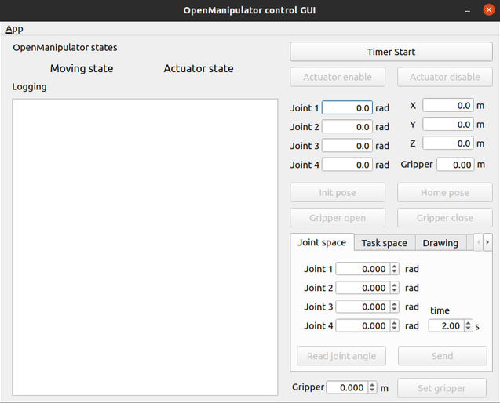 
</p>

4. Verify the positions and save it in the new cpp code .
5. Is recomended to simulate first in Gazebo to avoid problems with the real Open.

Launch Gazebo:
```ROS
$ roslaunch open_manipulator_gazebo open_manipulator_gazebo.launch
```
Connect the Open to Gazebo
```ROS
$ roslaunch open_manipulator_controller open_manipulator_controller.launch use_platform:=false
```
Launch your program
```ROS
$ roslaunch open_manipulator_teleop open_manipulator_teleop_Pick_and_Place.launch
```
<p align="center">
  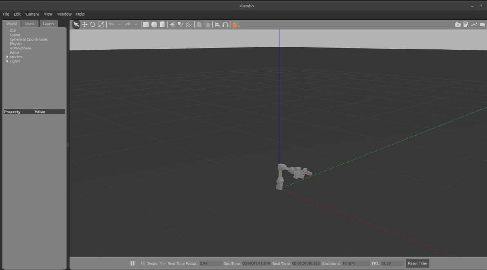 
</p>


if the simulation is correct now you can do it with the OpenManipulatorX

## Important Links
This proyect is based on the Keyboard cpp program, however new functions are called and created, if you want to see the main differences with the original project this link can be check:

https://github.com/ROBOTIS-GIT/open_manipulator

For the OpenManipulator e-Manual you can Check this link:

https://emanual.robotis.com/docs/en/platform/openmanipulator_x/overview/

For the Open CR:

https://emanual.robotis.com/docs/en/parts/controller/opencr10/

Also, other source where more information can be found is the the following book:

http://wiki.ros.org/Books/ROS_Robot_Programming_English


[Back to Top](#top)

## Contact 
Authors:
José Miguel Zúñiga Juárez - jose.zunigajz@udlap.mx - Github: mike130201

Diego de Jesús Gutiérrez Reyes - diego.gutierrezrs@udlap.mx - Github: DiegoJGutierrezReyes

André Federico López Hernández - andre.lopezhz@udlap.mx - Github: andre261220

Project Link: https://github.com/mike130201/Pick_and_Place

# Enjoy, entertain yourself, and improve the program!
